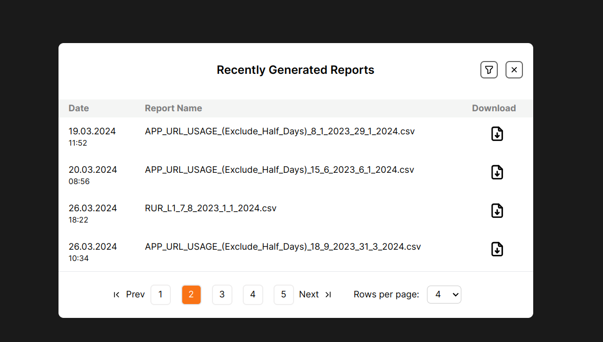

# Monter Frontend Developer Assignment 

**Problem Statement**: 
You have to design a dialog box where we can show a list of recently generated Reports within a time period of last 30 days.
- Design below UI/UX mentioned image in Next.js 
- You can use Dummy Data to show the below list .
- Create a Custom Paginator (Don't use any npm package or Module)

## Tech Stack used

- NextJs : frontend framework
- Tailwind CSS : CSS framework that provides frequently used CSS styles
- react-icons : Icon library

## Description of Application

The web application is a single page website. The Modal is Open by default and the initial state of the modal can be triggered easily from the code. 

### Modal
The modal contains list of recently generated Reports within a time period of last 30 days. It contains a table having 3 columns Date, Report and Download as shown in the provided design. The Modal also features a custom built Paginator for the table. 

### Home page
By default the Modal's backdrop blurs the homepage. When modal is closed the homepage is revealed to the user. It comprises of a simple Yellow colored button against a black background. The button when clicked opens the Modal and thereby serves as a trigger.

### Data
The data used in table is dummy data and has been generated by the generateData function provided in the utils folder. The dates, and filenames are randomly generated and a dummy file is served for download when the download button is clicked.